# Diagramas de sequência das APIs

Este documento apresenta os principais fluxos de chamada da API de votação usando diagramas de sequência em Mermaid.

## 1. Criar pauta

Endpoint:

```http
POST /api/v1/pautas
```

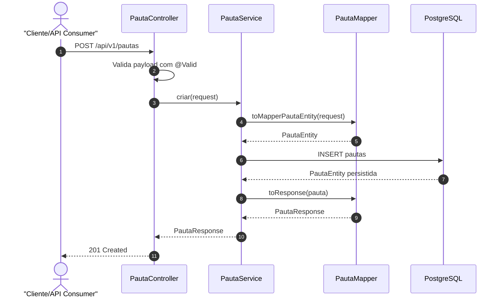

Fluxos de erro:

- `400 Bad Request`: título em branco ou payload inválido.
- `500 Internal Server Error`: erro inesperado de persistência ou aplicação.

## 2. Visualizar pautas

Endpoints:

```http
GET /api/v1/pautas
GET /api/v1/pautas/{pautaId}
GET /api/v1/pautas/{pautaId}/sessao-aberta
```

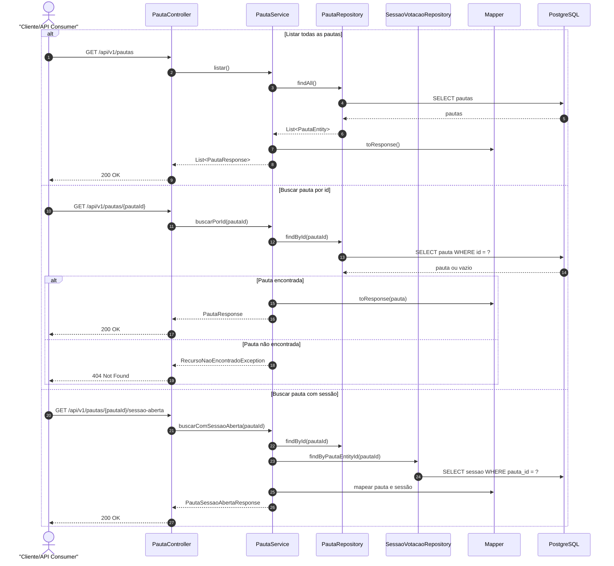

## 3. Atualizar e deletar pauta

Endpoints:

```http
PUT /api/v1/pautas/{pautaId}
DELETE /api/v1/pautas/{pautaId}
```

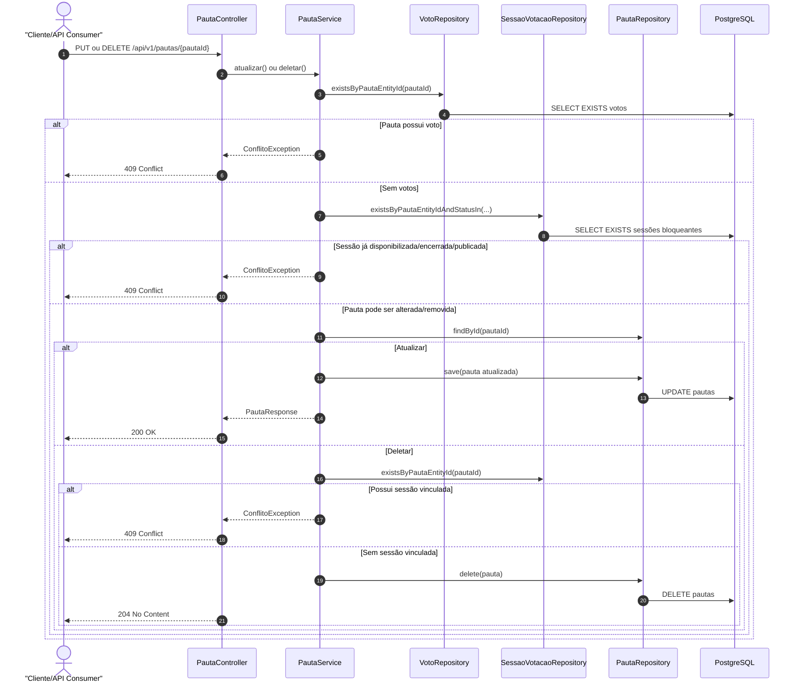

## 4. Criar sessão de votação

Endpoint:

```http
POST /api/v1/pautas/{pautaId}/sessoes
```

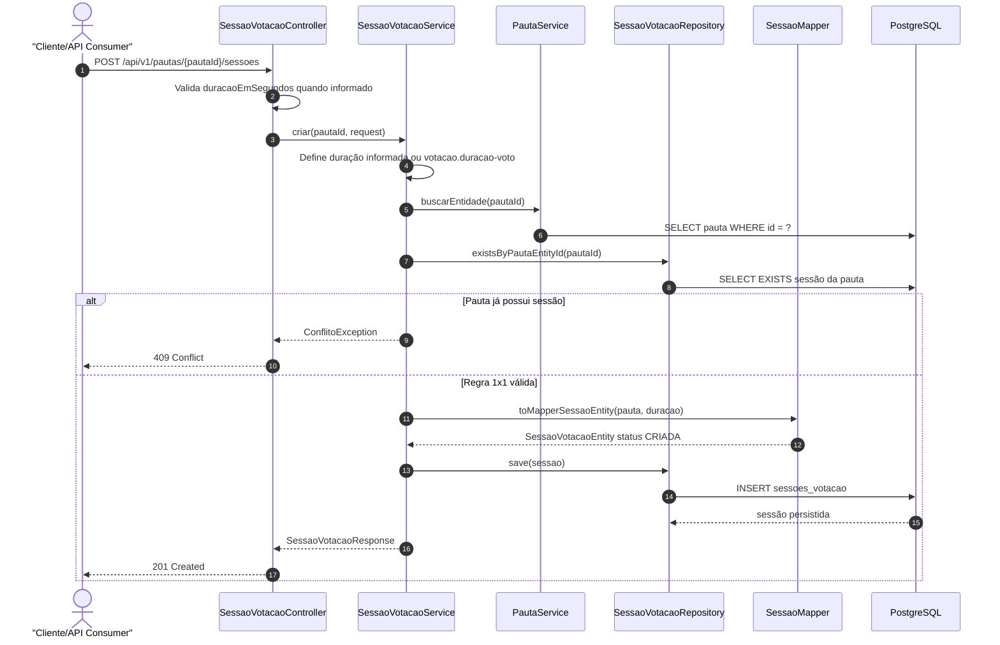

Observação de negócio:

- A sessão nasce como `CRIADA`.
- O prazo de votação ainda não começa nesse momento.
- A contagem começa apenas quando a sessão é disponibilizada.

## 5. Disponibilizar sessão para votação

Endpoint:

```http
POST /api/v1/sessoes/{sessaoId}/disponibilizar
```

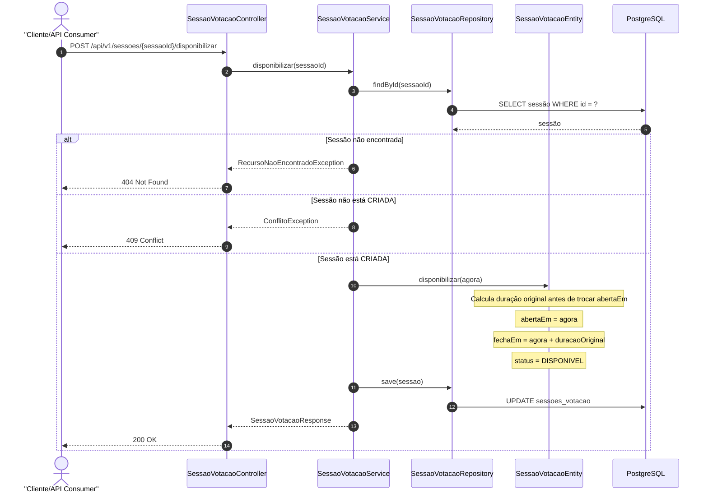

Regra importante:

- O prazo de encerramento fica na sessão.
- A votação começa a contar somente após a disponibilização.

## 6. Registrar voto

Endpoint:

```http
POST /api/v1/pautas/{pautaId}/votos
```

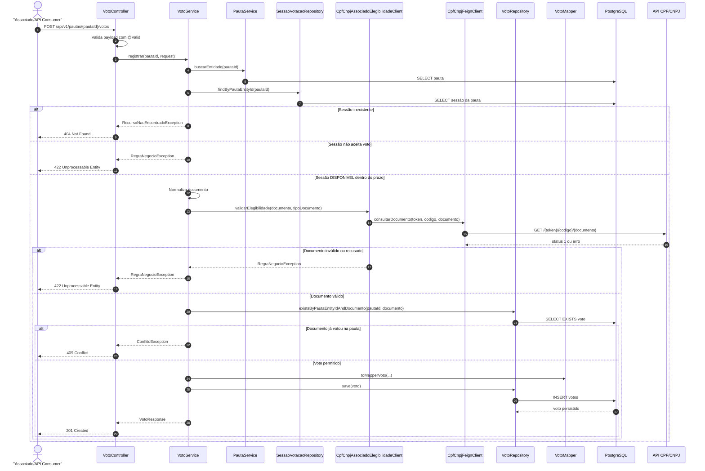

## 7. Consultar resultado

Endpoint:

```http
GET /api/v1/pautas/{pautaId}/resultado
```

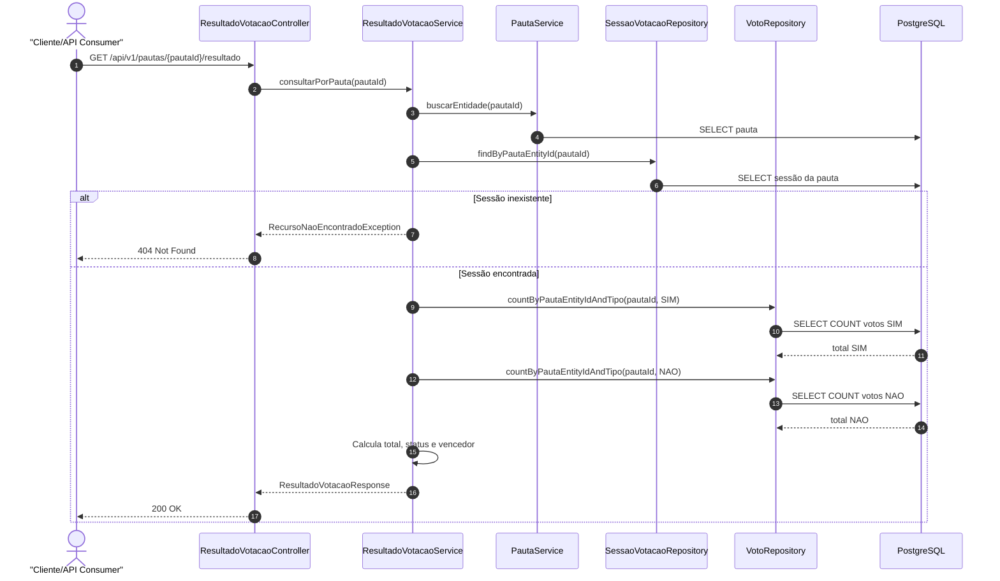

Observação de performance:

- O resultado é calculado por `COUNT` no banco.
- A aplicação não carrega todos os votos em memória.

## 8. Encerrar sessão manualmente

Endpoint:

```http
POST /api/v1/sessoes/{sessaoId}/encerrar
```

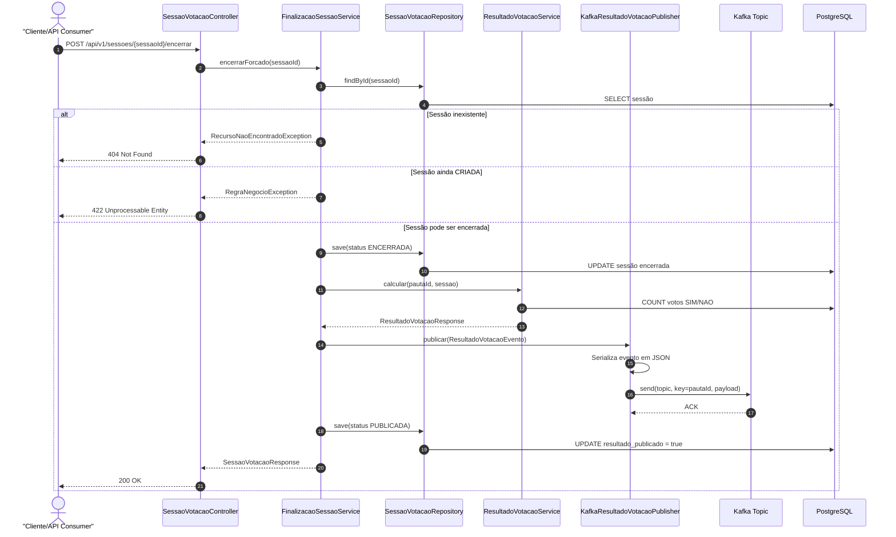

## 9. Finalizar sessões vencidas por endpoint

Endpoint:

```http
POST /api/v1/sessoes/finalizar
```

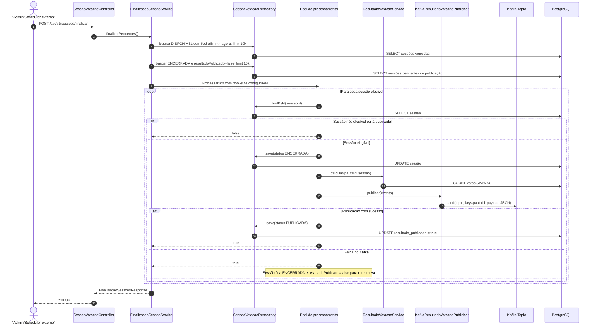

## 10. Finalização automática por cron job

Componente:

```text
FinalizacaoSessaoJob
```

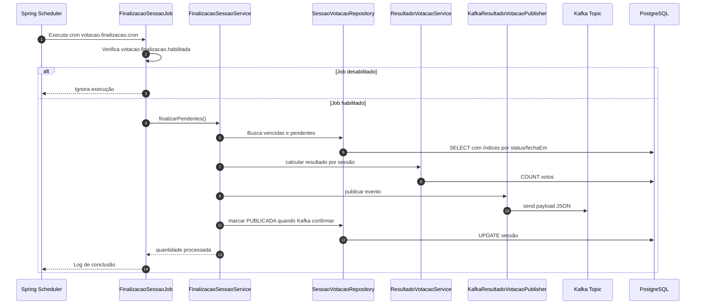

## 11. Publicação Kafka

Tópico padrão:

```text
votacao.resultado.encerrado
```

Payload JSON enviado:

```json
{
  "id": 21,
  "titulo": "Aprovação de nova política de crédito",
  "descricao": "Votação sobre a política proposta para o próximo ciclo.",
  "pauta": {
    "pautaId": 21,
    "votosSim": 1,
    "votosNao": 1,
    "totalVotos": 2,
    "status": "SESSAO_ENCERRADA",
    "vencedor": "EMPATE"
  }
}
```

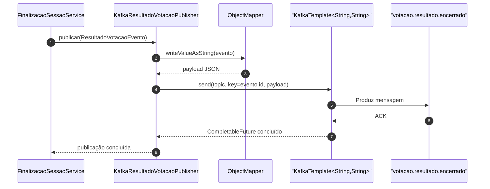

## 12. Tratamento global de erros

Componente:

```text
ApiExceptionHandler
```

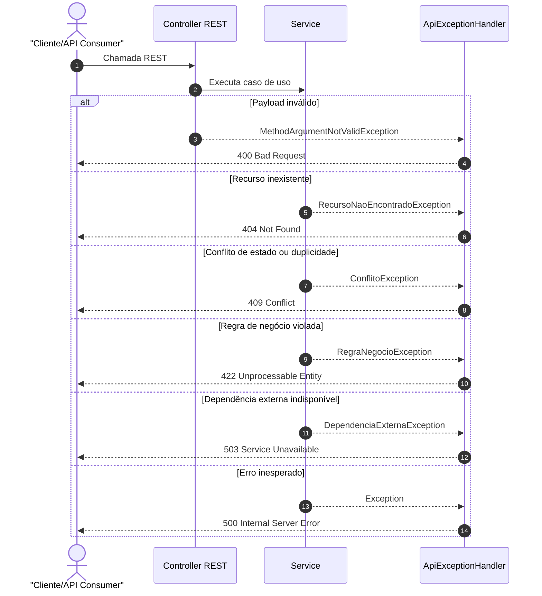

## Resumo das decisões representadas

- A pauta não controla prazo de votação.
- A sessão controla `abertaEm`, `fechaEm`, `status` e publicação do resultado.
- A duração da votação começa ao disponibilizar a sessão.
- A regra de voto único é validada na aplicação e reforçada no banco.
- Resultado é calculado por agregação no banco.
- Encerramento publica evento Kafka em JSON.
- Sessões não publicadas podem ser reprocessadas pelo cron ou endpoint de finalização.
