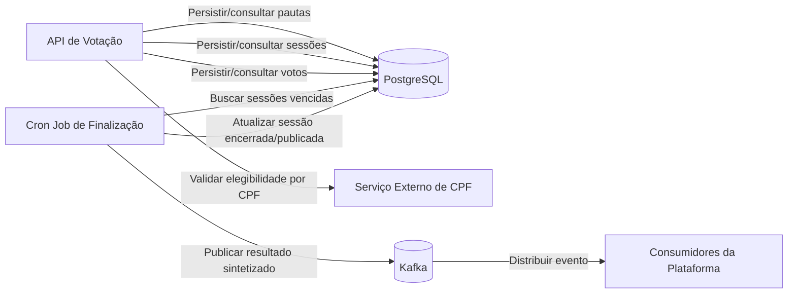
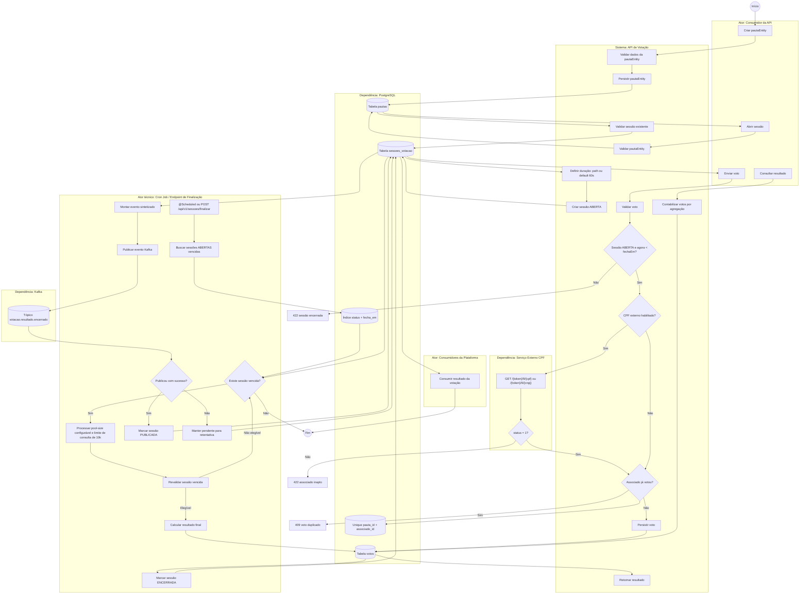
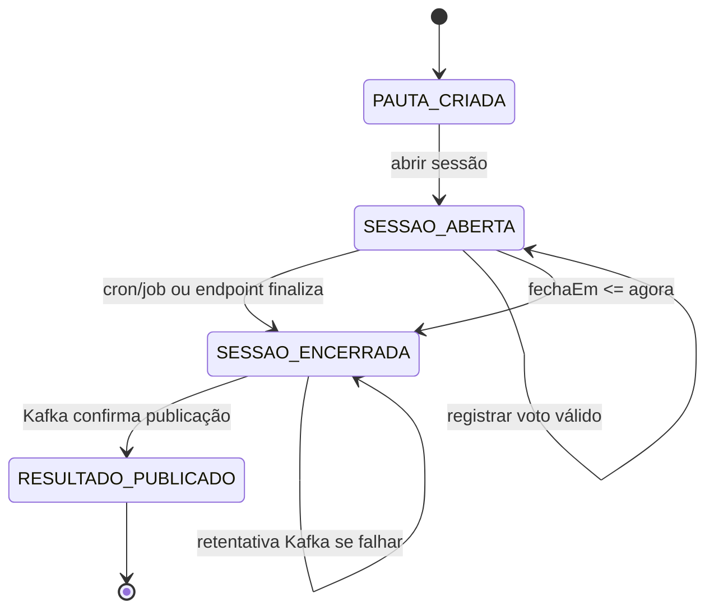

# Fluxo BPMN de dependências - API de Votação

## 1. Objetivo

Este documento descreve o fluxo BPMN lógico da aplicação de votação, apresentando os atores envolvidos, suas responsabilidades e as dependências entre API, banco de dados, serviço externo, job de finalização e Kafka.

O objetivo é apoiar a implementação da solução e deixar claro onde cada regra de negócio deve ser executada.

## 2. Atores e responsabilidades

| Ator | Responsabilidade |
| --- | --- |
| Consumidor da API | Chama endpoints REST para criar pautaEntity, abrir sessão, votar e consultar resultado. |
| API de Votação | Expõe endpoints, valida entradas, aplica regras de negócio e coordena serviços. |
| Banco de Dados | Persiste pautas, sessões e votos; garante constraints e índices. |
| Serviço Externo de CPF | Informa se o associado está apto ou não a votar. |
| Cron Job de Finalização | Busca sessões vencidas, finaliza votação e dispara publicação do resultado. |
| Kafka | Recebe evento sintetizado com o resultado final da pautaEntity. |
| Consumidores da Plataforma | Consomem o evento Kafka de encerramento da votação. |

## 3. Dependências principais



## 4. BPMN - Fluxo principal da votação

```mermaid
flowchart TB
    start(("Início"))
    end(("Fim"))

    subgraph L1["Consumidor da API"]
        A1["Solicita criação de pautaEntity"]
        A2["Solicita abertura de sessão"]
        A3["Envia voto"]
        A4["Consulta resultado"]
    end

    subgraph L2["API de Votação"]
        B1["Validar dados da pautaEntity"]
        B2["Criar pautaEntity"]
        B3{"Pauta existe?"}
        B4{"Sessão já existe?"}
        B5["Definir duração da sessão"]
        B6["Abrir sessão"]
        B7["Validar payload do voto"]
        B8{"Sessão está aberta e dentro do prazo?"}
        B9{"Validação CPF habilitada?"}
        B10{"Associado já votou?"}
        B11["Registrar voto"]
        B12["Calcular resultado por agregação"]
        B13["Retornar resposta"]
    end

    subgraph L3["Banco de Dados"]
        C1[("Salvar pautaEntity")]
        C2[("Consultar pautaEntity")]
        C3[("Consultar sessão")]
        C4[("Salvar sessão ABERTA")]
        C5[("Verificar voto único")]
        C6[("Salvar voto")]
        C7[("Contar votos SIM/NAO")]
    end

    subgraph L4["Serviço Externo de CPF"]
        D1["Consultar CPF"]
        D2{"Associado apto?"}
    end

    start --> A1 --> B1 --> B2 --> C1 --> B13
    B13 --> A2 --> B3
    B3 -->|"Não"| E404A["Retornar 404 pautaEntity inexistente"]
    B3 -->|"Sim"| C2 --> B4
    B4 -->|"Sim"| E409A["Retornar 409 sessão já existente"]
    B4 -->|"Não"| B5 --> B6 --> C4 --> B13

    B13 --> A3 --> B7 --> C2 --> C3 --> B8
    B8 -->|"Não"| E422A["Retornar 422 sessão encerrada"]
    B8 -->|"Sim"| B9
    B9 -->|"Sim"| D1 --> D2
    D2 -->|"Não"| E422B["Retornar 422 associado inapto"]
    D2 -->|"Sim"| C5
    B9 -->|"Não"| C5
    C5 --> B10
    B10 -->|"Sim"| E409B["Retornar 409 voto duplicado"]
    B10 -->|"Não"| B11 --> C6 --> B13

    B13 --> A4 --> B12 --> C7 --> B13 --> end
```

## 4.1 Fluxo Mermaid consolidado

Este fluxo resume o processo completo da aplicação em um único diagrama Mermaid, incluindo API, banco de dados, validação externa, cron job e Kafka.



## 5. BPMN - Abertura da sessão

```mermaid
flowchart TB
    start(("Início"))
    end(("Sessão aberta"))

    subgraph Consumer["Consumidor da API"]
        A1["POST /api/v1/pautas/{pautaId}/sessoes"]
        A2["ou POST /api/v1/pautas/{pautaId}/sessoes/{duracaoEmSegundos}"]
    end

    subgraph API["API de Votação"]
        B1["Receber pautaId"]
        B2{"duracaoEmSegundos informado?"}
        B3["Usar duração informada"]
        B4["Usar default 60 segundos"]
        B5{"Duração > 0?"}
        B6{"Pauta existe?"}
        B7{"Sessão já existe para pautaEntity?"}
        B8["Calcular abertaEm = agora"]
        B9["Calcular fechaEm = abertaEm + duração"]
        B10["Criar sessão status ABERTA"]
        B11["Retornar 201 Created"]
    end

    subgraph DB["Banco de Dados"]
        C1[("Consultar pautaEntity")]
        C2[("Consultar sessão por pautaEntity")]
        C3[("Salvar sessão")]
    end

    start --> A1 --> B1
    A2 --> B1
    B1 --> B2
    B2 -->|"Sim"| B3 --> B5
    B2 -->|"Não"| B4 --> B5
    B5 -->|"Não"| E400["400 duração inválida"]
    B5 -->|"Sim"| C1 --> B6
    B6 -->|"Não"| E404["404 pautaEntity inexistente"]
    B6 -->|"Sim"| C2 --> B7
    B7 -->|"Sim"| E409["409 sessão já existente"]
    B7 -->|"Não"| B8 --> B9 --> B10 --> C3 --> B11 --> end
```

## 6. BPMN - Registro de voto

```mermaid
flowchart TB
    start(("Início"))
    end(("Voto registrado"))

    subgraph Consumer["Consumidor da API"]
        A1["POST /api/v1/pautas/{pautaId}/votos"]
    end

    subgraph API["API de Votação"]
        B1["Validar associadoId, CPF e voto"]
        B2{"Payload válido?"}
        B3{"Pauta existe?"}
        B4{"Sessão existe?"}
        B5{"status = ABERTA e agora < fechaEm?"}
        B6{"Validação CPF habilitada?"}
        B7{"CPF apto?"}
        B8{"Já existe voto da pautaEntity para associado?"}
        B9["Persistir voto"]
        B10["Retornar 201 Created"]
    end

    subgraph DB["Banco de Dados"]
        C1[("Consultar pautaEntity")]
        C2[("Consultar sessão")]
        C3[("Consultar voto por pautaEntity + associado")]
        C4[("Salvar voto")]
        C5[("Constraint única pauta_id + associado_id")]
    end

    subgraph CPF["Serviço Externo de CPF"]
        D1["GET /{token}/9/{cpf} ou /{token}/6/{cnpj}"]
        D2["Retorna status 1 ou status 0"]
    end

    start --> A1 --> B1 --> B2
    B2 -->|"Não"| E400["400 payload inválido"]
    B2 -->|"Sim"| C1 --> B3
    B3 -->|"Não"| E404A["404 pautaEntity inexistente"]
    B3 -->|"Sim"| C2 --> B4
    B4 -->|"Não"| E404B["404 sessão inexistente"]
    B4 -->|"Sim"| B5
    B5 -->|"Não"| E422A["422 sessão encerrada"]
    B5 -->|"Sim"| B6
    B6 -->|"Sim"| D1 --> D2 --> B7
    B7 -->|"Não"| E422B["422 associado inapto"]
    B7 -->|"Sim"| C3
    B6 -->|"Não"| C3
    C3 --> B8
    B8 -->|"Sim"| E409["409 voto duplicado"]
    B8 -->|"Não"| B9 --> C4 --> C5 --> B10 --> end
```

## 7. BPMN - Cron job de finalização e Kafka

```mermaid
flowchart TB
    start(("Início agendado"))
    end(("Fim da execução"))

    subgraph JOB["Cron Job de Finalização"]
        A1["@Scheduled inicia execução"]
        A2["Definir agora, pool-size e limite 10k"]
        A3["Buscar sessões vencidas"]
        A4{"Existe sessão pendente?"}
        A5["Selecionar próxima sessão"]
        A6{"Sessão ainda está ABERTA e vencida?"}
        A7["Contabilizar votos"]
        A8["Marcar sessão como ENCERRADA"]
        A9["Montar evento sintetizado"]
        A10["Publicar no Kafka"]
        A11{"Publicação teve sucesso?"}
        A12["Marcar sessão como PUBLICADA"]
        A13["Manter ENCERRADA e resultadoPublicado=false"]
        A14["Registrar log de falha para retentativa"]
        A15{"Ainda há itens no batch?"}
    end

    subgraph DB["Banco de Dados"]
        B1[("Consultar status=ABERTA e fecha_em <= agora")]
        B2[("COUNT votos SIM")]
        B3[("COUNT votos NAO")]
        B4[("UPDATE condicional para ENCERRADA")]
        B5[("UPDATE para PUBLICADA")]
    end

    subgraph KAFKA["Kafka"]
        C1[("Tópico votacao.resultado.encerrado")]
    end

    subgraph PLATFORM["Consumidores da Plataforma"]
        D1["Consumir resultado encerrado"]
    end

    start --> A1 --> A2 --> A3 --> B1 --> A4
    A4 -->|"Não"| end
    A4 -->|"Sim"| A5 --> A6
    A6 -->|"Não"| A15
    A6 -->|"Sim"| A7
    A7 --> B2 --> B3 --> A8 --> B4 --> A9 --> A10 --> C1 --> A11
    A11 -->|"Sim"| A12 --> B5 --> D1 --> A15
    A11 -->|"Não"| A13 --> A14 --> A15
    A15 -->|"Sim"| A5
    A15 -->|"Não"| end
```

## 8. BPMN - Endpoint alternativo de finalização

```mermaid
flowchart TB
    start(("Início"))
    end(("Fim"))

    subgraph Scheduler["Scheduler externo ou operador"]
        A1["POST /api/v1/sessoes/finalizar"]
    end

    subgraph API["API de Votação"]
        B1["Receber solicitação"]
        B2["Chamar mesmo caso de uso do cron job"]
        B3["Processar batch de sessões vencidas"]
        B4["Retornar quantidade processada"]
    end

    subgraph Finalizer["Finalizador de Sessões"]
        C1["Buscar sessões vencidas"]
        C2["Encerrar sessão"]
        C3["Calcular resultado"]
        C4["Publicar Kafka"]
        C5["Marcar como PUBLICADA"]
    end

    start --> A1 --> B1 --> B2 --> C1 --> C2 --> C3 --> C4 --> C5 --> B3 --> B4 --> end
```

## 9. Payload publicado no Kafka

Tópico:

```text
votacao.resultado.encerrado
```

Chave recomendada:

```text
pautaId
```

Mensagem:

```json
{
  "id": 1,
  "titulo": "Aprovação de nova política de crédito",
  "descricao": "Votação sobre a política proposta para o próximo ciclo.",
  "pautaEntity": {
    "pautaId": 1,
    "votosSim": 150,
    "votosNao": 90,
    "totalVotos": 240,
    "status": "SESSAO_ENCERRADA",
    "vencedor": "SIM"
  }
}
```

## 10. Regras críticas do BPMN

### 10.1 Sessão aberta

Uma sessão aceita voto somente quando:

```text
status = ABERTA
e
agora < fechaEm
```

Mesmo que o cron job ainda não tenha encerrado formalmente a sessão, a API deve recusar votos se `agora >= fechaEm`.

### 10.2 Duração da sessão

Regras:

- Endpoint sem duração usa `60 segundos`.
- Endpoint com `{duracaoEmSegundos}` usa o valor informado no path.
- Duração deve ser maior que zero.

### 10.3 Voto único

Regras:

- Um associado só pode votar uma vez por pautaEntity.
- A API valida antes de gravar.
- O banco reforça com constraint única em `pauta_id + associado_id`.

### 10.4 Finalização performática

Regras:

- Buscar somente `status = ABERTA`.
- Buscar somente `fecha_em <= agora`.
- Usar índice em `status + fecha_em`.
- Processar em pool-size configurável e limite de consulta de 10k.
- Contar votos com agregação no banco.
- Não carregar todos os votos em memória.

### 10.5 Idempotência da publicação

Regras:

- Sessão `PUBLICADA` não deve ser publicada novamente.
- Sessão `ENCERRADA` com `resultadoPublicado = false` pode ser republicada.
- Falha no Kafka não reabre a sessão.
- Kafka deve receber chave estável, como `pautaId`.

## 11. Estados e transições



## 12. Resumo das integrações

| Origem | Destino | Quando ocorre | Finalidade |
| --- | --- | --- | --- |
| Consumidor da API | API de Votação | Chamadas REST | Executar comandos e consultas. |
| API de Votação | PostgreSQL | Todas as operações principais | Persistir e consultar estado. |
| API de Votação | Serviço Externo de CPF | Antes de registrar voto, se habilitado | Validar elegibilidade. |
| Cron Job | PostgreSQL | Em cada execução agendada | Buscar e atualizar sessões vencidas. |
| Cron Job | Kafka | Após encerrar sessão | Publicar resultado final. |
| Consumidores da Plataforma | Kafka | Após publicação | Reagir ao encerramento da pautaEntity. |
